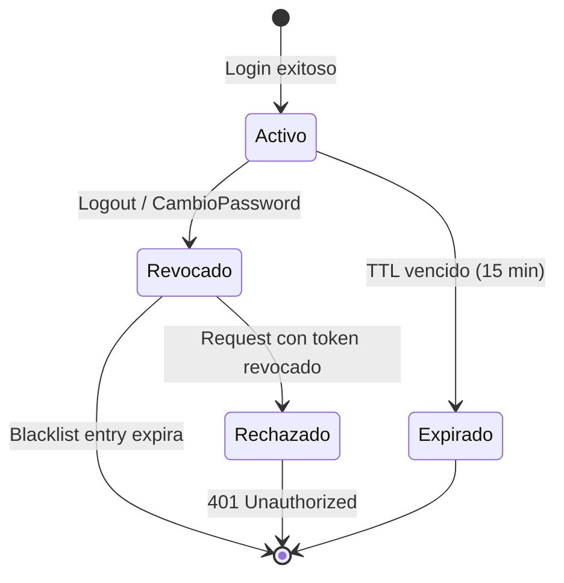
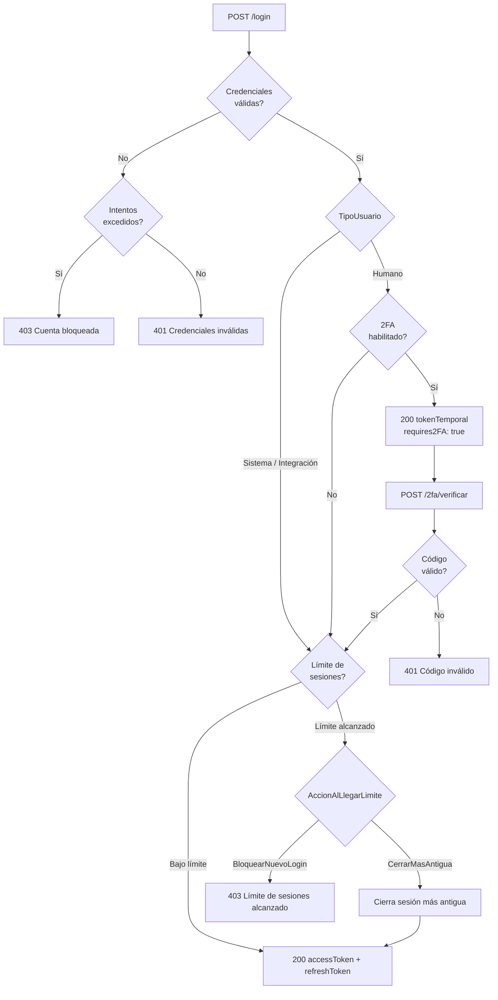
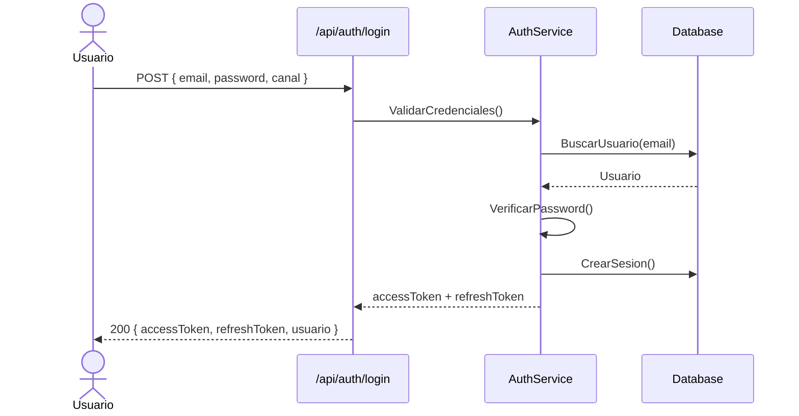
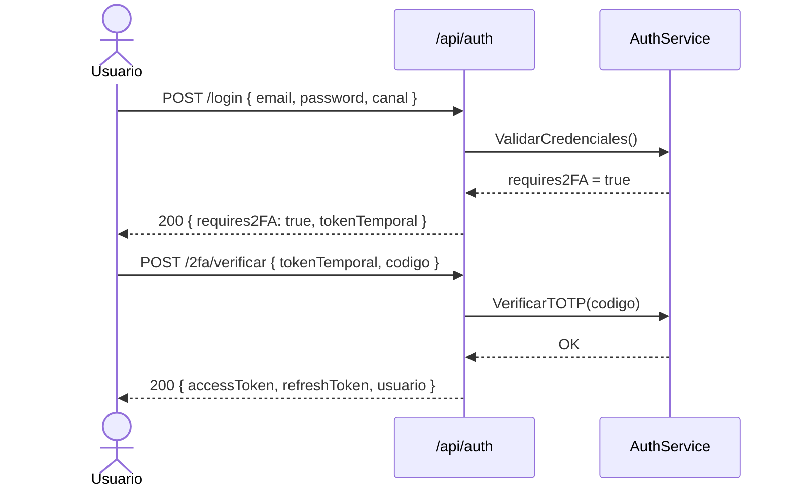
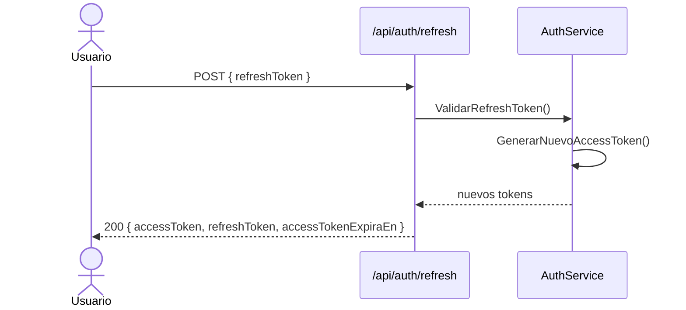
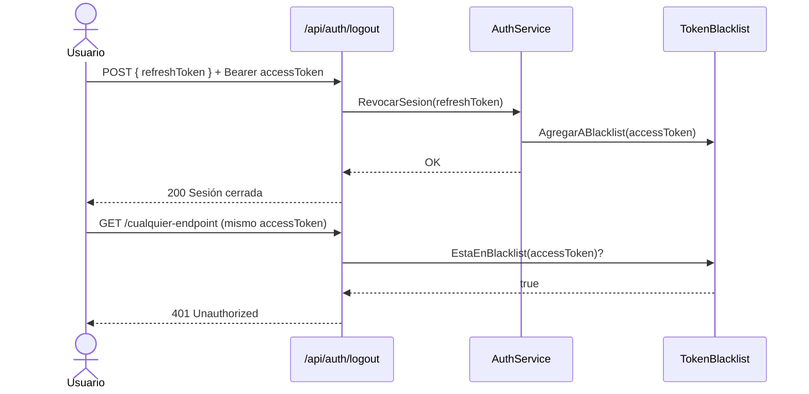
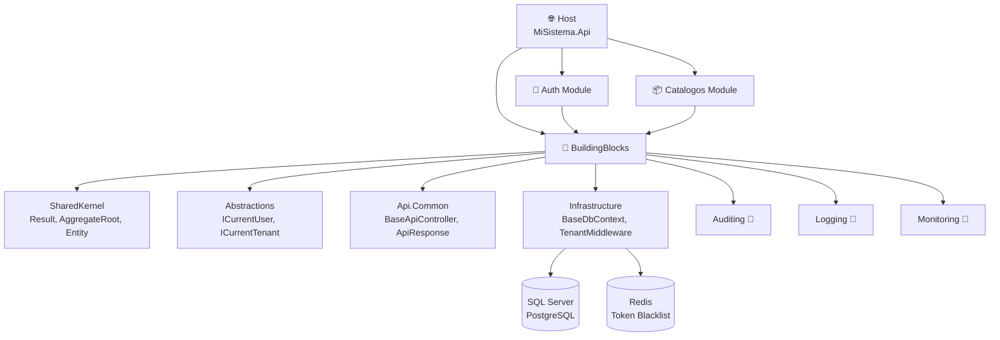
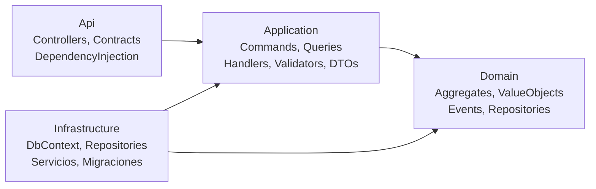
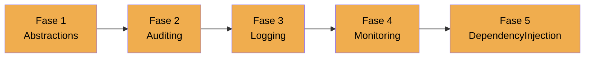

# CoreTemplate

Plantilla base reutilizable para sistemas **ASP.NET Core 10** con **Clean Architecture + DDD + CQRS**.

Clona esta plantilla, ejecuta un script y tendrás un sistema funcional con autenticación enterprise-grade, sesiones gestionables, token blacklist, multi-tenant configurable, sucursales opcionales y un catálogo de ejemplo listo para extender.

---

## ¿Qué incluye?

| Módulo | Descripción |
|---|---|
| **Auth** | Login JWT, Sesiones gestionables, Token Blacklist, Tipos de usuario, Canales de acceso, 2FA TOTP, Roles y Permisos, Sucursales (opcional), Catálogo de Acciones (opcional), Auditoría |
| **Catálogos** | Catálogo de ejemplo completamente implementado — sirve como patrón para crear nuevos catálogos |
| **SharedKernel** | `Result<T>`, `PagedResult<T>`, `AggregateRoot`, `Entity`, `ValueObject`, `IDomainEvent` |
| **Abstractions** | `ICurrentUser`, `ICurrentTenant`, `ICurrentBranch`, `IDateTimeProvider` — contratos sin dependencia de Infrastructure |
| **Api.Common** | `ApiResponse<T>`, `BaseApiController`, `GlobalExceptionHandler`, `ValidationBehavior` |
| **Infrastructure** | `BaseDbContext` multi-tenant, implementaciones de Abstractions, `TenantMiddleware` |
| **Auditing** 🔧 | `IAuditService`, `AuditLog`, `AuditSaveChangesInterceptor` — auditoría automática y explícita |
| **Logging** 🔧 | `IAppLogger`, `ICorrelationContext`, `CorrelationMiddleware` — logging estructurado con X-Correlation-Id |
| **Monitoring** 🔧 | Health checks para DB y Redis, endpoints `/health`, `/health/ready`, `/health/live` |

> 🔧 = En plan de implementación. Ver [PLAN-MEJORAS-BUILDING-BLOCKS.md](docs/PLAN-MEJORAS-BUILDING-BLOCKS.md)

---

## Requisitos

- [.NET 10 SDK](https://dotnet.microsoft.com/download/dotnet/10.0)
- SQL Server o PostgreSQL
- Redis (opcional, para Token Blacklist en producción)
- PowerShell 5.1+ (para el script de renombrado)

---

## Inicio rápido

### 1. Clonar la plantilla

```bash
git clone https://github.com/tu-usuario/CoreTemplate.git MiSistema
cd MiSistema
```

### 2. Renombrar al nombre de tu sistema

```powershell
.\rename.ps1 -SystemName "MiSistema"
```

### 3. Configurar la base de datos

Edita `src/Host/MiSistema.Api/appsettings.Development.json`:

```json
{
  "DatabaseSettings": {
    "Provider": "SqlServer",
    "ConnectionString": "Server=localhost;Database=MiSistemaDb;User Id=sa;Password=TuPassword;TrustServerCertificate=True;"
  }
}
```

### 4. Ejecutar migraciones

```bash
dotnet ef database update \
  --project src/Modules/Auth/MiSistema.Modules.Auth.Infrastructure \
  --startup-project src/Host/MiSistema.Api \
  --context AuthDbContext

dotnet ef database update \
  --project src/Modules/Catalogos/MiSistema.Modules.Catalogos.Infrastructure \
  --startup-project src/Host/MiSistema.Api \
  --context CatalogosDbContext
```

### 5. Ejecutar

```bash
cd src/Host/MiSistema.Api
dotnet run
```

Abre `https://localhost:5001/swagger`.

### 6. Primer login

Al arrancar en Development, el seeder crea automáticamente:

| Campo | Valor |
|---|---|
| Email | `admin@coretemplate.com` |
| Password | `Admin@1234!` |
| Rol | `SuperAdmin` |

```bash
POST /api/auth/login
{
  "email": "admin@coretemplate.com",
  "password": "Admin@1234!",
  "canal": "Web"
}
```

---

## Configuración completa

### appsettings.json

```json
{
  "DatabaseSettings": {
    "Provider": "SqlServer",
    "ConnectionString": "..."
  },
  "TenantSettings": {
    "IsMultiTenant": false,
    "TenantResolutionStrategy": "Header",
    "EnableSessionLimitsPerTenant": false
  },
  "AuthSettings": {
    "JwtSecretKey": "CAMBIAR-EN-PRODUCCION-MINIMO-256-BITS",
    "JwtIssuer": "MiSistema",
    "JwtAudience": "MiSistema",
    "AccessTokenExpirationMinutes": 15,
    "RefreshTokenExpirationDays": 7,
    "TwoFactorEnabled": false,
    "TwoFactorRequired": false,
    "PasswordResetTokenExpirationHours": 1,
    "MaxSesionesSimultaneas": 5,
    "AccionAlLlegarLimiteSesiones": "CerrarMasAntigua",
    "EnableTokenBlacklist": true,
    "UseActionCatalog": false
  },
  "LockoutSettings": {
    "MaxFailedAttempts": 5,
    "LockoutDurationMinutes": 15,
    "AutoUnlock": true
  },
  "PasswordPolicy": {
    "MinLength": 8,
    "RequireUppercase": true,
    "RequireLowercase": true,
    "RequireDigit": true,
    "RequireSpecialChar": false
  },
  "TokenBlacklistSettings": {
    "Provider": "InMemory",
    "RedisConnectionString": ""
  },
  "OrganizationSettings": {
    "EnableBranches": false
  }
}
```

### Multi-tenant

| `IsMultiTenant` | Comportamiento |
|---|---|
| `false` (default) | Single-tenant — TenantId ignorado |
| `true` | Filtrado automático por TenantId, header `X-Tenant-Id` requerido |

Con `EnableSessionLimitsPerTenant: true` cada tenant puede tener su propio límite de sesiones (jerarquía: Tenant > Global > Default 5).

### Sesiones

| Configuración | Descripción |
|---|---|
| `MaxSesionesSimultaneas` | Límite de sesiones activas por usuario (default: 5) |
| `AccionAlLlegarLimiteSesiones` | `CerrarMasAntigua` o `BloquearNuevoLogin` |

### Token Blacklist

| `Provider` | Cuándo usar |
|---|---|
| `InMemory` | Desarrollo o un solo servidor |
| `Redis` | Producción con múltiples instancias |

Con `EnableTokenBlacklist: true`, los tokens se invalidan inmediatamente al hacer logout o cambiar contraseña.



### Tipos de usuario

```csharp
public enum TipoUsuario { Humano = 1, Sistema = 2, Integracion = 3 }
```

| Tipo | Comportamiento |
|---|---|
| `Humano` | Aplican todas las reglas: 2FA, bloqueo, límite de sesiones |
| `Sistema` | Sin 2FA, sin bloqueo, sin límite de sesiones |
| `Integracion` | Sin 2FA, sin bloqueo, sin límite de sesiones |

### Canales de acceso

```csharp
public enum CanalAcceso { Web = 1, Mobile = 2, Api = 3, Desktop = 4 }
```

Cada sesión registra el canal de origen. Se incluye como claim `canal` en el JWT.

### Sucursales (opcional)

```json
{
  "OrganizationSettings": {
    "EnableBranches": false
  }
}
```

Con `EnableBranches: true`:
- Los usuarios se asignan a una o más sucursales con una principal
- El JWT incluye el claim `branch_id` de la sucursal activa
- Los roles se pueden asignar por combinación `usuario + sucursal`
- El usuario puede cambiar su sucursal activa con `PUT /api/perfil/sucursal-activa`

### Catálogo de Acciones (opcional)

```json
{
  "AuthSettings": {
    "UseActionCatalog": false
  }
}
```

Con `UseActionCatalog: true`, los permisos se gestionan como aggregates desde `/api/acciones` en lugar de strings estáticos.

### 2FA

| Configuración | Comportamiento |
|---|---|
| `TwoFactorEnabled: false` | 2FA deshabilitado |
| `TwoFactorEnabled: true, TwoFactorRequired: false` | 2FA opcional por usuario |
| `TwoFactorEnabled: true, TwoFactorRequired: true` | 2FA obligatorio (solo usuarios Humano) |



---

## Endpoints disponibles

### Auth (`/api/auth`)

| Método | Ruta | Descripción | Auth |
|---|---|---|---|
| POST | `/login` | Login (soporta `canal` y `tipoUsuario`) | No |
| POST | `/registro` | Registrar nuevo usuario | No |
| POST | `/refresh` | Renovar AccessToken | No |
| POST | `/logout` | Cerrar sesión + blacklist del token | Sí |
| POST | `/solicitar-restablecimiento` | Solicitar reset de contraseña | No |
| POST | `/restablecer-password` | Restablecer contraseña con token | No |
| POST | `/2fa/activar` | Iniciar activación de 2FA | Sí |
| POST | `/2fa/confirmar` | Confirmar activación con código TOTP | Sí |
| POST | `/2fa/verificar` | Verificar código TOTP en login | No |
| POST | `/2fa/desactivar` | Desactivar 2FA | Sí |

### Usuarios (`/api/usuarios`)

| Método | Ruta | Descripción |
|---|---|---|
| GET | `/` | Listar usuarios (paginado) |
| GET | `/{id}` | Obtener usuario por ID |
| PUT | `/{id}/activar` | Activar usuario |
| PUT | `/{id}/desactivar` | Desactivar usuario |
| PUT | `/{id}/desbloquear` | Desbloquear usuario |
| POST | `/{id}/roles` | Asignar rol global |
| DELETE | `/{id}/roles/{rolId}` | Quitar rol global |
| GET | `/{id}/sesiones` | Ver sesiones activas (admin) |
| DELETE | `/{id}/sesiones` | Cerrar todas las sesiones (admin) |
| POST | `/{id}/sucursales/{sucursalId}/roles` | Asignar rol por sucursal |
| DELETE | `/{id}/sucursales/{sucursalId}/roles/{rolId}` | Quitar rol por sucursal |

### Perfil (`/api/perfil`)

| Método | Ruta | Descripción |
|---|---|---|
| GET | `/` | Ver mi perfil |
| PUT | `/cambiar-password` | Cambiar contraseña |
| GET | `/sesiones` | Ver mis sesiones activas |
| DELETE | `/sesiones/{id}` | Cerrar una sesión específica |
| DELETE | `/sesiones/otras` | Cerrar todas excepto la actual |
| PUT | `/sucursal-activa` | Cambiar sucursal activa |

### Roles (`/api/roles`)

| Método | Ruta | Descripción |
|---|---|---|
| GET | `/` | Listar roles |
| GET | `/{id}` | Obtener rol por ID |
| POST | `/` | Crear rol |
| PUT | `/{id}` | Actualizar rol |
| DELETE | `/{id}` | Eliminar rol |

### Sucursales (`/api/sucursales`) — requiere `EnableBranches: true`

| Método | Ruta | Descripción |
|---|---|---|
| GET | `/` | Listar sucursales |
| POST | `/` | Crear sucursal |
| GET | `/usuarios/{usuarioId}` | Ver sucursales de un usuario |
| POST | `/usuarios/{usuarioId}` | Asignar sucursal a usuario |
| DELETE | `/usuarios/{usuarioId}/{sucursalId}` | Remover sucursal de usuario |

### Acciones (`/api/acciones`) — requiere `UseActionCatalog: true`

| Método | Ruta | Descripción |
|---|---|---|
| GET | `/` | Listar acciones (filtrable por módulo) |
| POST | `/` | Crear acción |
| PUT | `/{id}/activar` | Activar acción |
| PUT | `/{id}/desactivar` | Desactivar acción |

### Tenants (`/api/tenants`) — requiere `IsMultiTenant: true`

| Método | Ruta | Descripción |
|---|---|---|
| GET | `/{tenantId}/configuracion` | Ver configuración del tenant |
| PUT | `/{tenantId}/limite-sesiones` | Configurar límite de sesiones |

### Catálogos (`/api/catalogos`)

| Método | Ruta | Descripción |
|---|---|---|
| GET | `/` | Listar ítems (paginado, filtrable, buscable) |
| GET | `/{id}` | Obtener ítem por ID |
| POST | `/` | Crear ítem |
| PUT | `/{id}/activar` | Activar ítem |
| PUT | `/{id}/desactivar` | Desactivar ítem |

---

## Flujo de autenticación

### Login normal



### Login con 2FA activo



### Renovar token



### Logout con blacklist



---

## Formato de respuesta

```json
{
  "success": true,
  "message": "Operación exitosa.",
  "data": { ... },
  "errors": []
}
```

---

## Arquitectura



```
src/
├── BuildingBlocks/
│   ├── SharedKernel       → Result, PagedResult, AggregateRoot, Entity, ValueObject
│   ├── Abstractions       → ICurrentUser, ICurrentTenant, ICurrentBranch, IDateTimeProvider
│   ├── Api.Common         → ApiResponse, BaseApiController, GlobalExceptionHandler
│   ├── Infrastructure     → BaseDbContext, implementaciones de Abstractions, TenantMiddleware
│   ├── Auditing 🔧         → IAuditService, AuditLog, AuditSaveChangesInterceptor
│   ├── Logging 🔧          → IAppLogger, ICorrelationContext, CorrelationMiddleware
│   └── Monitoring 🔧       → Health checks (DB, Redis), endpoints /health
├── Host/
│   └── MiSistema.Api      → Program.cs, appsettings, punto de entrada
└── Modules/
    ├── Auth/              → Autenticación enterprise-grade
    └── Catalogos/         → Catálogo de ejemplo (patrón reutilizable)

tests/
├── SharedKernel.Tests     → 19 tests
├── Auth.Tests             → 92 tests
└── Catalogos.Tests        → 15 tests
```

> 🔧 = En plan de implementación. Ver [PLAN-MEJORAS-BUILDING-BLOCKS.md](docs/PLAN-MEJORAS-BUILDING-BLOCKS.md)

### Capas por módulo



---

## Estructura de la base de datos

| Schema | Tablas |
|---|---|
| `Auth` | Usuarios, Roles, Permisos, UsuarioRoles, RolPermisos, Sesiones, TokensRestablecimiento, CodigosRecuperacion2FA, RegistrosAuditoria, Sucursales, UsuarioSucursales, AsignacionesRol, Acciones, ConfiguracionesTenant |
| `Catalogos` | CatalogoItems |
| `Shared` 🔧 | AuditLogs |

---

## Tests

```bash
dotnet test
```

Resultado esperado: **126 tests — 0 fallos**

---

## Tecnologías

| Tecnología | Versión | Uso |
|---|---|---|
| ASP.NET Core | 10 | Framework web |
| Entity Framework Core | 10 | ORM |
| MediatR | 14 | CQRS |
| FluentValidation | 12 | Validaciones |
| BCrypt.Net | 4 | Hash de contraseñas |
| Otp.NET | 1.4 | 2FA TOTP |
| StackExchange.Redis | 2.8 | Token Blacklist (opcional) |
| Serilog | 9 | Logging estructurado |
| xUnit v3 | 3 | Tests unitarios |
| FluentAssertions | 8 | Assertions en tests |
| NSubstitute | 5 | Mocks en tests |
| Swashbuckle | 6.9 | Swagger/OpenAPI |

---

## Roadmap de mejoras

Ver [PLAN-MEJORAS-BUILDING-BLOCKS.md](docs/PLAN-MEJORAS-BUILDING-BLOCKS.md) para el detalle completo.

| Fase | Building Block | Estado |
|---|---|---|
| 1 | `CoreTemplate.Abstractions` | 🔧 Pendiente |
| 2 | `CoreTemplate.Auditing` | 🔧 Pendiente |
| 3 | `CoreTemplate.Logging` | 🔧 Pendiente |
| 4 | `CoreTemplate.Monitoring` | 🔧 Pendiente |
| 5 | `DependencyInjection` en capas Api | 🔧 Pendiente |



---

## Licencia

MIT — libre para uso comercial y personal.
