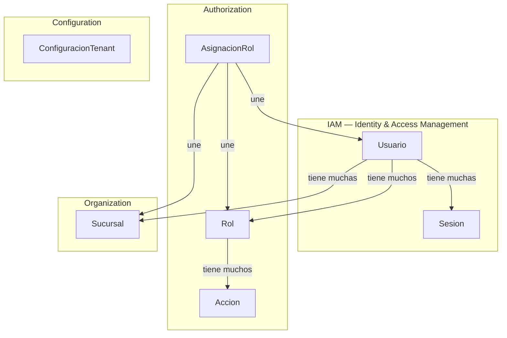
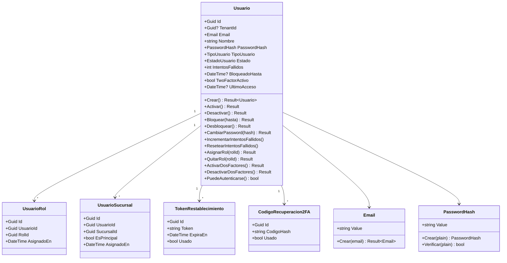
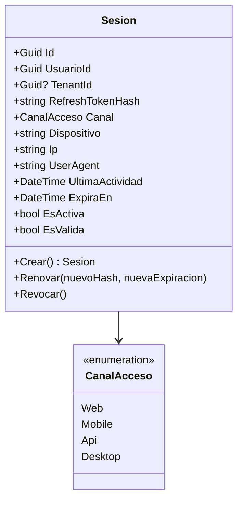
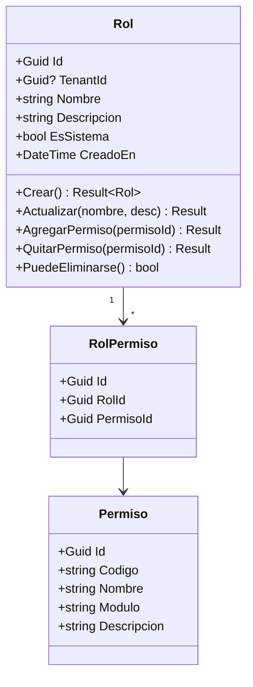
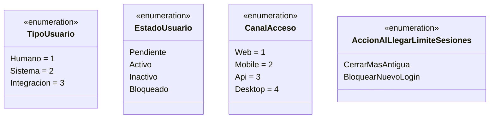
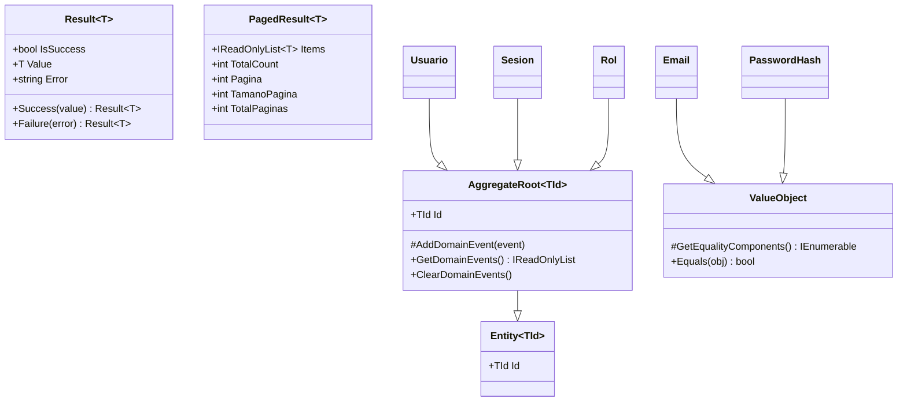
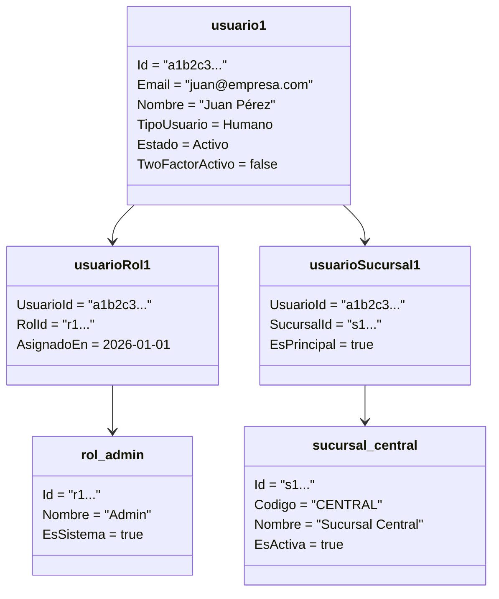
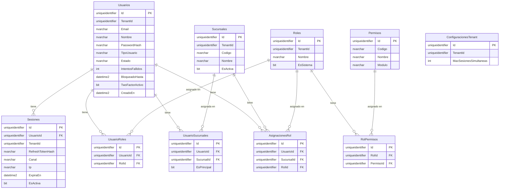

# Modelo de Dominio — Diagramas

> Complementa: `docs/Auth/02-Analisis-Tradicional/02-MODELO-DOMINIO.md` y `10-MODELO-DATOS.md`  
> Fecha: 2026-04-15

---

## Diagramas de Clases

### Diagrama 1: Bounded Contexts

---

### Diagrama 2: Aggregate Usuario

---

### Diagrama 3: Aggregate Sesion

---

### Diagrama 4: Aggregate Rol

---

### Diagrama 5: Enumeraciones del Dominio

---

### Diagrama 6: SharedKernel — Clases Base

---

## Diagrama de Objetos

### Diagrama 7: Instancia de ejemplo — Usuario con Roles y Sucursales

---

## Diagrama ER

### Diagrama 8: Modelo de Datos — Schema Auth

