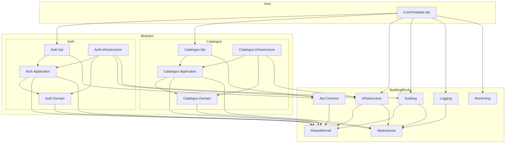
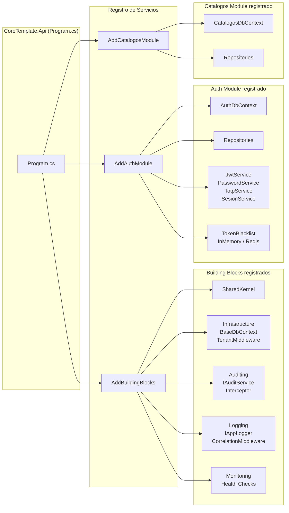
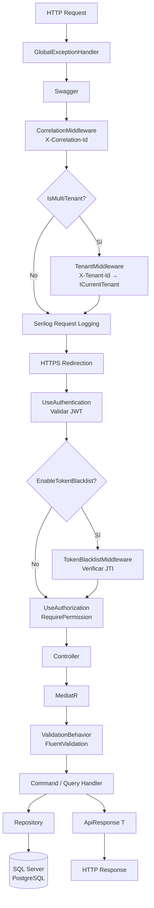
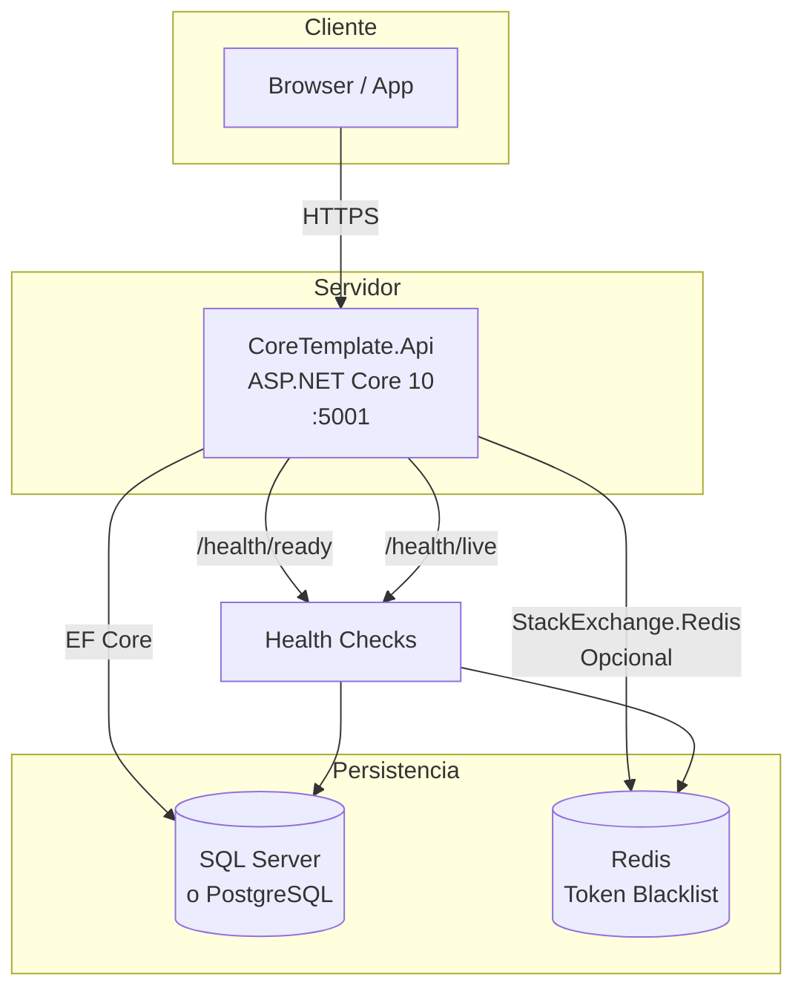
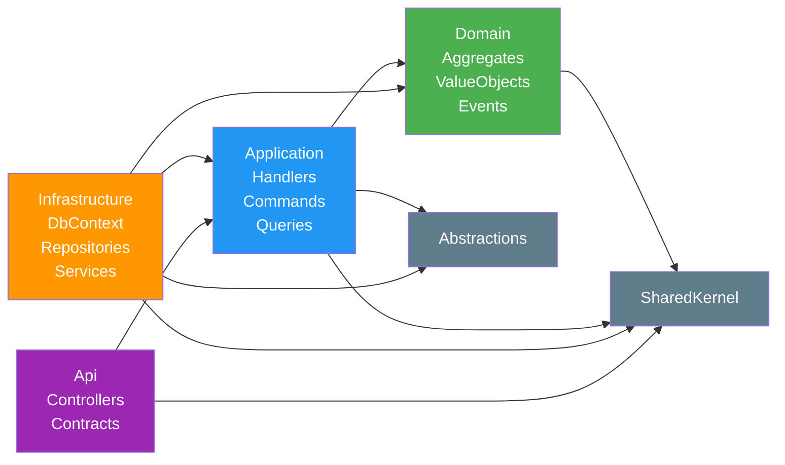

# SAD — Diagramas de Arquitectura

> Complementa: `docs/architecture/ARQUITECTURA.md`  
> Fecha: 2026-04-15

---

## Diagrama 1: Paquetes — Dependencias entre Proyectos

Muestra qué proyecto referencia a cuál (dependencias reales de `.csproj`).

---

## Diagrama 2: Componentes — Ensamblado en Program.cs

Muestra cómo se registran los módulos y building blocks en el Host.

---

## Diagrama 3: Componentes — Pipeline de un Request HTTP

Muestra el orden exacto del middleware y el flujo hasta la base de datos.

---

## Diagrama 4: Despliegue

Muestra la infraestructura en producción.

---

## Diagrama 5: Reglas de Dependencia entre Capas

Muestra qué puede depender de qué (la regla de Clean Architecture).

