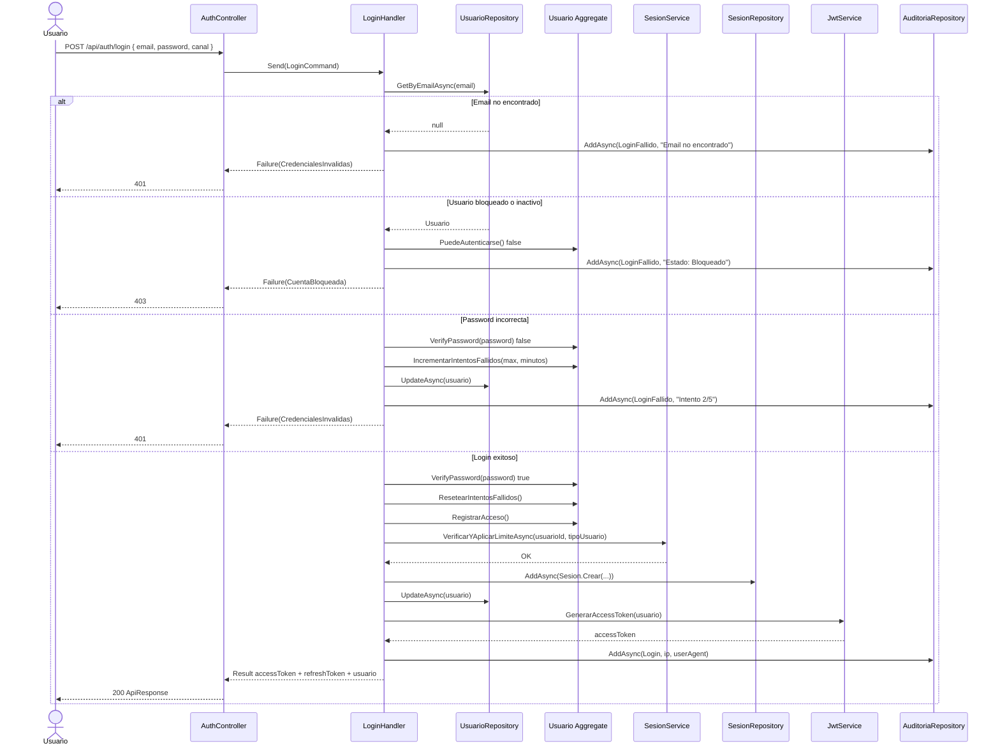
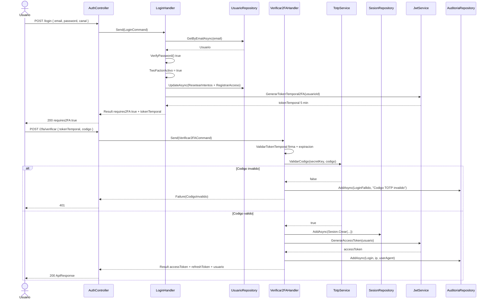
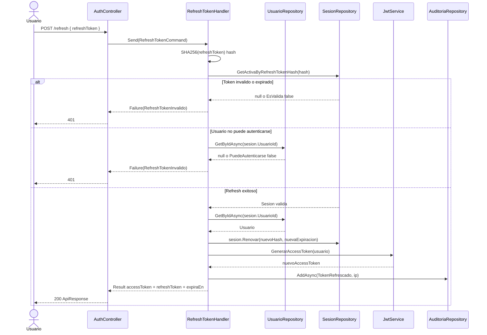
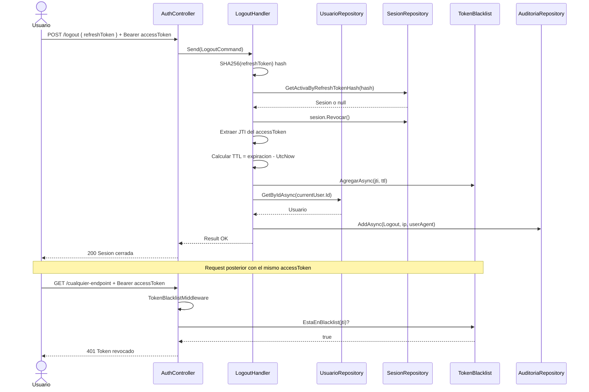
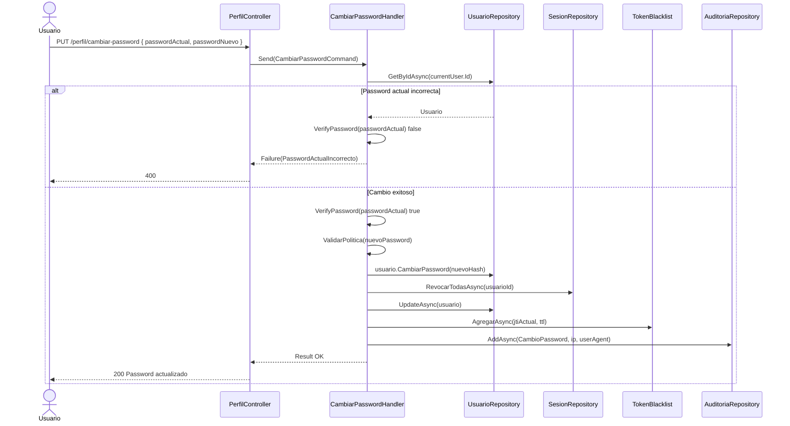
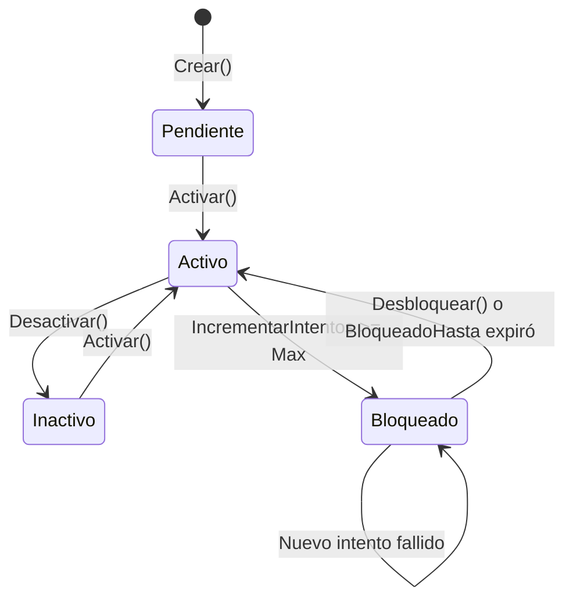
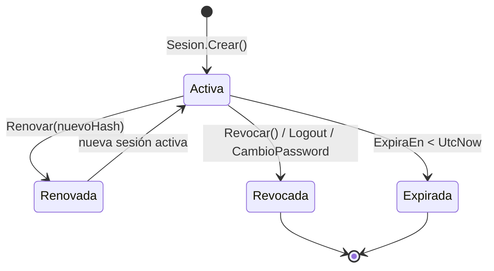
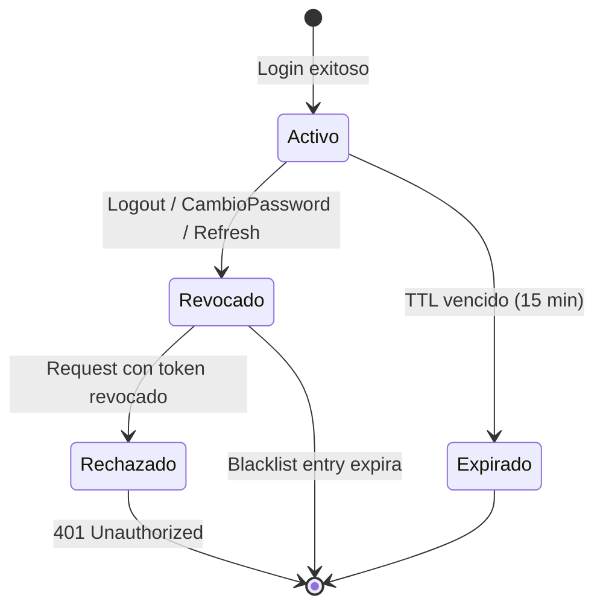
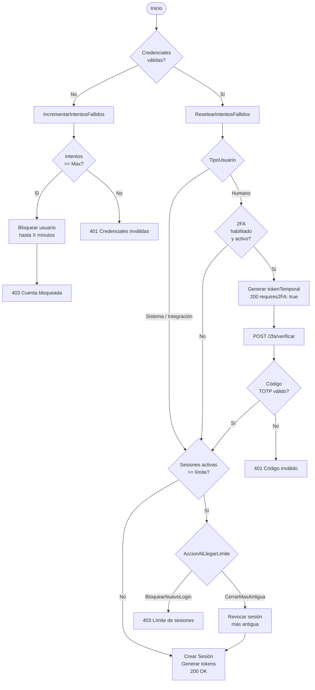
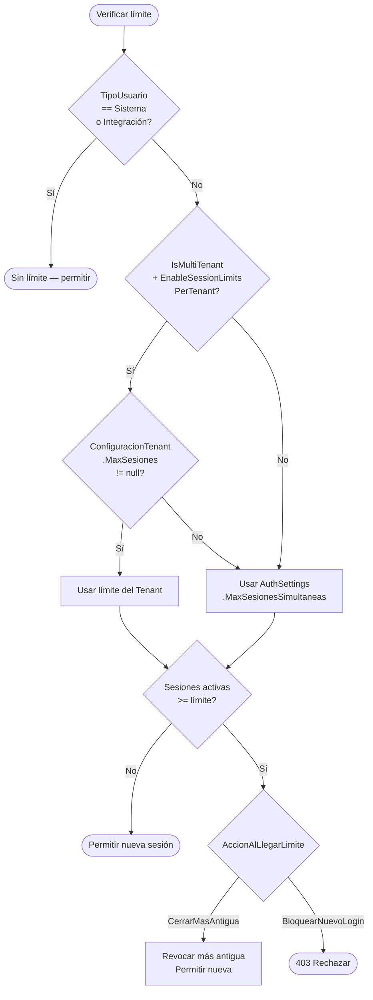

# SDD — Diagramas de Diseño

> Complementa: `docs/Auth/02-Analisis-Tradicional/13-DIAGRAMAS.md`  
> Fecha: 2026-04-15

---

## Diagramas de Secuencia

### Diagrama 1: Login Normal

---

### Diagrama 2: Login con 2FA

---

### Diagrama 3: Refresh Token

---

### Diagrama 4: Logout con Blacklist

---

### Diagrama 5: Cambiar Password

---

## Diagramas de Estado

### Diagrama 6: Estados del Usuario

---

### Diagrama 7: Estados de la Sesión

---

### Diagrama 8: Estados del Token JWT

---

## Diagramas de Actividad

### Diagrama 9: Flujo de Decisión del Login

---

### Diagrama 10: Jerarquía de Límite de Sesiones

