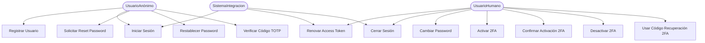
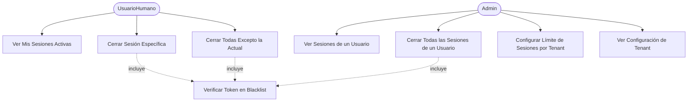
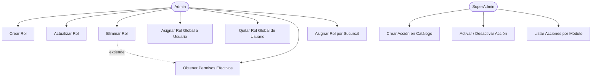
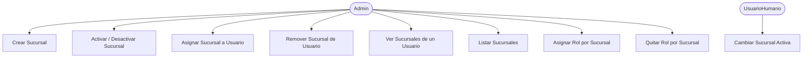
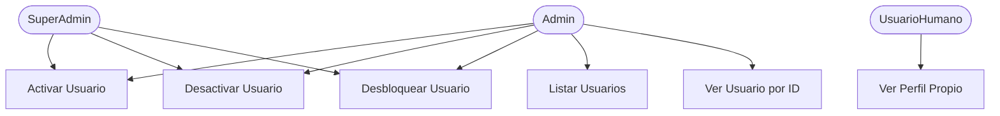
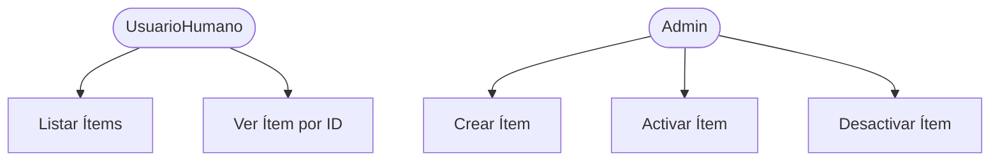

# SRS — Diagramas de Casos de Uso

> Complementa: `docs/Auth/02-Analisis-Tradicional/01-CASOS-DE-USO-*.md`  
> Fecha: 2026-04-15

---

## Actores del Sistema

| Actor | Descripción |
|---|---|
| **UsuarioAnónimo** | No autenticado — solo puede registrarse o hacer login |
| **UsuarioHumano** | Autenticado — persona real, aplican todas las reglas |
| **Admin** | Autenticado con rol Admin — gestiona usuarios, roles, sucursales |
| **SuperAdmin** | Autenticado con rol SuperAdmin — acceso total, no puede desactivarse |
| **SistemaIntegracion** | Usuario de tipo Sistema o Integración — sin 2FA, sin bloqueo, sin límite de sesiones |

---

## Diagrama 1: Autenticación

---

## Diagrama 2: Gestión de Sesiones

---

## Diagrama 3: Autorización — Roles y Permisos

---

## Diagrama 4: Sucursales (EnableBranches = true)

---

## Diagrama 5: Administración de Usuarios

---

## Diagrama 6: Catálogos

